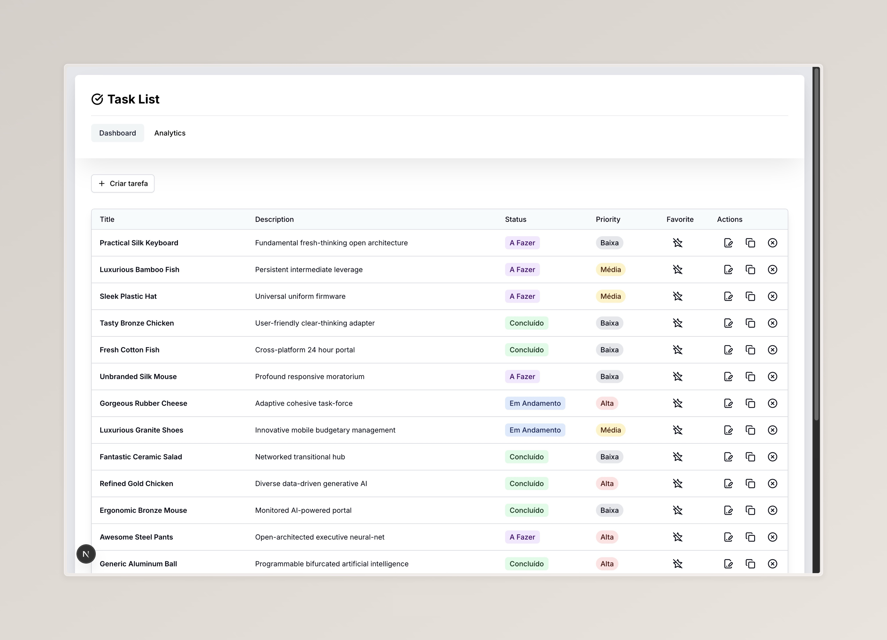
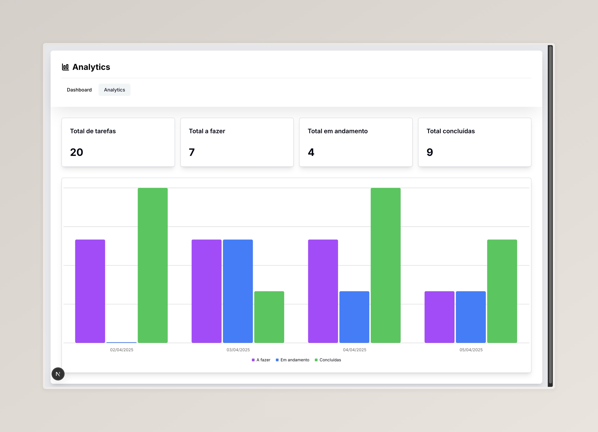

# 🚀 Gerenciador de Tarefas

Este é um projeto de gerenciamento de tarefas.

---

## ✨ Visão Geral

Foi desenvolvido utilizando:

- **Next.js**
- **TypeScript**
- **Tailwind CSS**
- **Prisma**
- **shadcn**

O deploy foi feito na **Vercel**.

---

## 📝 Funcionalidades

1. **Tabela de Gerenciamento de Tarefas**
   - Título, descrição e status (ex.: “A Fazer”, “Em Andamento” ou “Concluída”).
   - Operações de criação, edição, exclusão e listagem em uma tabela.

2. **Dashboard de Analytics**
   - Exibição de estatísticas (número total de tarefas, concluídas vs. pendentes, etc.).
   - Pelo menos um gráfico ou algum outro tipo de visualização de dados.

3. **Prioridade de Tarefas**
   - Cada tarefa deve ter uma prioridade (ex.: alta, média, baixa).

4. **Duplicar Tarefas**
   - Funcionalidade para clonar uma tarefa existente.
   - Se houver subtarefas, elas também devem ser copiadas.

5. **Favoritos**
   - Possibilidade de marcar tarefas como favoritas, facilitando o acesso.

---

## 📦 O que foi feito

- [x] Criar página de dashboard
- [x] Criar tabela de gerenciamento de tarefas
- [x] Adicionar status de tarefas
- [x] Adicionar prioridade de tarefas
- [x] Adicionar funcionalidade de criar tarefa
- [x] Adicionar funcionalidade de editar tarefa
- [x] Adicionar funcionalidade de deletar tarefa
- [x] Adicionar funcionalidade de duplicar tarefa
- [x] Adicionar funcionalidade de favoritar tarefa
- [x] Criar página de analytics
- [x] Adicionar gráfico de barras de analytics
- [x] Adicionar cards de analytics com dados numéricos
- [ ] Adicionar filtro por status e prioridade
- [ ] Adicionar subtarefas
- [ ] Adicionar etiquetas personalizadas
- [ ] Adicionar paginação
- [ ] Ajustar rolagem das páginas
- [ ] Adicionar testes unitários e de integração
